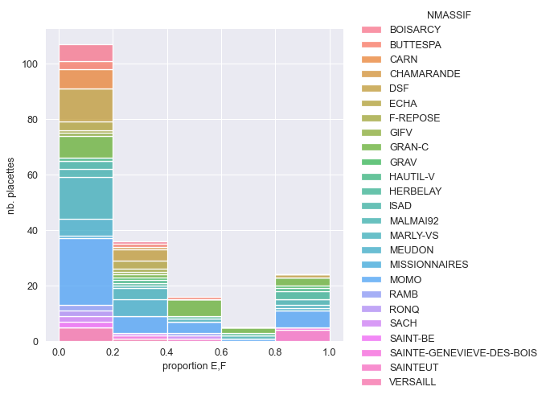
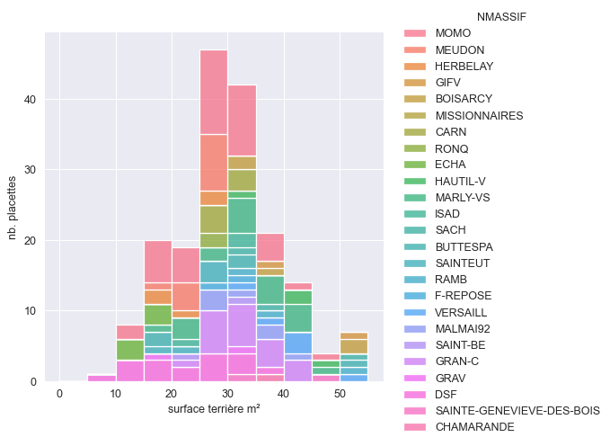
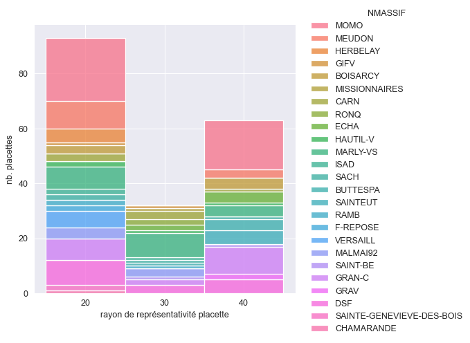
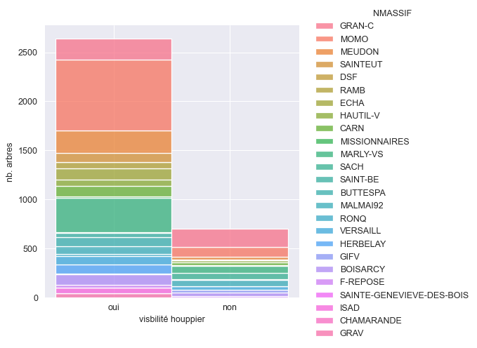

# DSF_CHT 2022

*2022-07-29_1204   fprigent-ONF*

### 188 placettes retenues (17 placettes epicollect)
#### 3760 arbres notés

## Localisation des relevés

|   NUM_PLAC | NMASSIF                   |   A |   B |   C |   D |   E |   F |   prop_EF |   prop_DEF |   etat_sanit |
|-----------:|:--------------------------|----:|----:|----:|----:|----:|----:|----------:|-----------:|-------------:|
|        122 | BOISARCY                  |   0 |  12 |   7 |   1 |   0 |   0 |      0    |       0.05 |            0 |
|        123 | BOISARCY                  |   0 |   3 |  15 |   2 |   0 |   0 |      0    |       0.1  |            0 |
|        125 | BOISARCY                  |   0 |   5 |   9 |   6 |   0 |   0 |      0    |       0.3  |            0 |
|        129 | BOISARCY                  |   0 |  16 |   4 |   0 |   0 |   0 |      0    |       0    |            0 |
|        133 | BOISARCY                  |   2 |  13 |   5 |   0 |   0 |   0 |      0    |       0    |            0 |
|        800 | BOISARCY                  |   0 |   5 |   5 |   6 |   0 |   4 |      0.2  |       0.5  |            1 |
|        801 | BOISARCY                  |   0 |  12 |   6 |   2 |   0 |   0 |      0    |       0.1  |            0 |
|         75 | BUTTESPA                  |   0 |   5 |   8 |   5 |   2 |   0 |      0.1  |       0.35 |            0 |
|         76 | BUTTESPA                  |   0 |   7 |   6 |   6 |   1 |   0 |      0.05 |       0.35 |            0 |
|         77 | BUTTESPA                  |   0 |   5 |   2 |   4 |   0 |   9 |      0.45 |       0.65 |            1 |
|         78 | BUTTESPA                  |   1 |   9 |   8 |   2 |   0 |   0 |      0    |       0.1  |            0 |
|         79 | BUTTESPA                  |   0 |   5 |   8 |   3 |   2 |   2 |      0.2  |       0.35 |            1 |
|         18 | CARN                      |   0 |  13 |   7 |   0 |   0 |   0 |      0    |       0    |            0 |
|         22 | CARN                      |   3 |   6 |   7 |   3 |   0 |   1 |      0.05 |       0.2  |            0 |
|         23 | CARN                      |   0 |  12 |   8 |   0 |   0 |   0 |      0    |       0    |            0 |
|         24 | CARN                      |   0 |  11 |   9 |   0 |   0 |   0 |      0    |       0    |            0 |
|        901 | CARN                      |   2 |  13 |   4 |   1 |   0 |   0 |      0    |       0.05 |            0 |
|        902 | CARN                      |   0 |  12 |   5 |   2 |   1 |   0 |      0.05 |       0.15 |            0 |
|        903 | CARN                      |   1 |  13 |   4 |   2 |   0 |   0 |      0    |       0.1  |            0 |
|        195 | CHAMARANDE                |   0 |   1 |  10 |   3 |   3 |   3 |      0.3  |       0.45 |            1 |
|          0 | DSF                       |   0 |   7 |   9 |   4 |   0 |   0 |      0    |       0.2  |            0 |
|          0 | DSF                       |   0 |   0 |   8 |   9 |   1 |   2 |      0.15 |       0.6  |            0 |
|          0 | DSF                       |   5 |   9 |   0 |   3 |   0 |   3 |      0.15 |       0.3  |            0 |
|          0 | DSF                       |   1 |   5 |  11 |   3 |   0 |   0 |      0    |       0.15 |            0 |
|          0 | DSF                       |   6 |   9 |   0 |   2 |   0 |   3 |      0.15 |       0.25 |            0 |
|          0 | DSF                       |   0 |   2 |   7 |   7 |   2 |   2 |      0.2  |       0.55 |            1 |
|          0 | DSF                       |   0 |   0 |   0 |   0 |   0 |  20 |      1    |       1    |            3 |
|          0 | DSF                       |   5 |  12 |   1 |   1 |   0 |   1 |      0.05 |       0.1  |            0 |
|          0 | DSF                       |   0 |  10 |   6 |   4 |   0 |   0 |      0    |       0.2  |            0 |
|          0 | DSF                       |   0 |   2 |   4 |  10 |   1 |   3 |      0.2  |       0.7  |            1 |
|          0 | DSF                       |   0 |   3 |   8 |   4 |   0 |   5 |      0.25 |       0.45 |            1 |
|          0 | DSF                       |   0 |   4 |   8 |   7 |   1 |   0 |      0.05 |       0.4  |            0 |
|          0 | DSF                       |   0 |   3 |   5 |   6 |   1 |   5 |      0.3  |       0.6  |            1 |
|          0 | DSF                       |   5 |  11 |   2 |   2 |   0 |   0 |      0    |       0.1  |            0 |
|          0 | DSF                       |   0 |   7 |   9 |   2 |   1 |   1 |      0.1  |       0.2  |            0 |
|          0 | DSF                       |  11 |   6 |   1 |   0 |   0 |   2 |      0.1  |       0.1  |            0 |
|          0 | DSF                       |   2 |   9 |   7 |   2 |   0 |   0 |      0    |       0.1  |            0 |
|        189 | ECHA                      |   2 |   9 |   4 |   4 |   1 |   0 |      0.05 |       0.25 |            0 |
|        190 | ECHA                      |   2 |  12 |   3 |   0 |   0 |   3 |      0.15 |       0.15 |            0 |
|        191 | ECHA                      |   1 |  12 |   1 |   1 |   2 |   3 |      0.25 |       0.3  |            1 |
|        192 | ECHA                      |   0 |  10 |   5 |   1 |   2 |   2 |      0.2  |       0.25 |            1 |
|        193 | ECHA                      |   3 |   6 |   7 |   2 |   2 |   0 |      0.1  |       0.2  |            0 |
|        193 | ECHA                      |   2 |  11 |   3 |   0 |   0 |   4 |      0.2  |       0.2  |            1 |
|        118 | F-REPOSE                  |   2 |   3 |   7 |   4 |   0 |   4 |      0.2  |       0.4  |            1 |
|        119 | F-REPOSE                  |   1 |   6 |   7 |   4 |   1 |   1 |      0.1  |       0.3  |            0 |
|        200 | GIFV                      |   1 |  11 |   6 |   0 |   0 |   2 |      0.1  |       0.1  |            0 |
|        201 | GIFV                      |   2 |   8 |   2 |   3 |   5 |   0 |      0.25 |       0.4  |            1 |
|        148 | GRAN-C                    |   0 |   5 |   2 |   4 |   2 |   7 |      0.45 |       0.65 |            1 |
|        149 | GRAN-C                    |   0 |   4 |   6 |   1 |   1 |   8 |      0.45 |       0.5  |            1 |
|        150 | GRAN-C                    |   0 |   1 |   3 |   2 |   0 |  14 |      0.7  |       0.8  |            2 |
|        151 | GRAN-C                    |   0 |   1 |   2 |   7 |   0 |  10 |      0.5  |       0.85 |            2 |
|        152 | GRAN-C                    |   0 |   2 |   0 |   2 |   1 |  15 |      0.8  |       0.9  |            3 |
|        153 | GRAN-C                    |   1 |   9 |   7 |   2 |   0 |   1 |      0.05 |       0.15 |            0 |
|        154 | GRAN-C                    |   0 |   5 |   8 |   2 |   3 |   2 |      0.25 |       0.35 |            1 |
|        155 | GRAN-C                    |   0 |   9 |   2 |   1 |   1 |   7 |      0.4  |       0.45 |            1 |
|        156 | GRAN-C                    |   0 |   2 |   0 |   1 |   3 |  14 |      0.85 |       0.9  |            3 |
|        157 | GRAN-C                    |   1 |  11 |   1 |   7 |   0 |   0 |      0    |       0.35 |            0 |
|        158 | GRAN-C                    |   0 |   1 |   1 |   2 |   1 |  15 |      0.8  |       0.9  |            3 |
|        159 | GRAN-C                    |   0 |   1 |   4 |   3 |   3 |   9 |      0.6  |       0.75 |            2 |
|        160 | GRAN-C                    |   0 |   1 |   3 |   7 |   0 |   9 |      0.45 |       0.8  |            1 |
|        161 | GRAN-C                    |   0 |   3 |   4 |   2 |   1 |  10 |      0.55 |       0.65 |            2 |
|        162 | GRAN-C                    |   3 |  15 |   1 |   0 |   0 |   1 |      0.05 |       0.05 |            0 |
|        163 | GRAN-C                    |   1 |  13 |   4 |   2 |   0 |   0 |      0    |       0.1  |            0 |
|        164 | GRAN-C                    |   9 |  10 |   1 |   0 |   0 |   0 |      0    |       0    |            0 |
|        165 | GRAN-C                    |   6 |  14 |   0 |   0 |   0 |   0 |      0    |       0    |            0 |
|        166 | GRAN-C                    |   0 |   7 |   5 |   7 |   0 |   1 |      0.05 |       0.4  |            0 |
|        167 | GRAN-C                    |   1 |  13 |   4 |   2 |   0 |   0 |      0    |       0.1  |            0 |
|        196 | GRAV                      |   0 |   1 |   0 |   3 |   7 |   9 |      0.8  |       0.95 |            3 |
|        197 | GRAV                      |   0 |   6 |   1 |   6 |   7 |   0 |      0.35 |       0.65 |            1 |
|         68 | HAUTIL-V                  |   0 |   2 |   2 |   9 |   1 |   6 |      0.35 |       0.8  |            1 |
|         69 | HAUTIL-V                  |   0 |   0 |   0 |   1 |   2 |  17 |      0.95 |       1    |            3 |
|         73 | HAUTIL-V                  |   0 |  11 |   9 |   0 |   0 |   0 |      0    |       0    |            0 |
|         74 | HAUTIL-V                  |   0 |   0 |   2 |   4 |   1 |  13 |      0.7  |       0.9  |            2 |
|         82 | HERBELAY                  |   0 |   1 |   2 |   6 |   4 |   7 |      0.55 |       0.85 |            2 |
|         83 | HERBELAY                  |   1 |   5 |   5 |   4 |   3 |   2 |      0.25 |       0.45 |            1 |
|         84 | HERBELAY                  |   0 |   1 |   0 |   3 |   3 |  13 |      0.8  |       0.95 |            3 |
|         85 | HERBELAY                  |   0 |   0 |   0 |   0 |   2 |  18 |      1    |       1    |            3 |
|         86 | HERBELAY                  |   0 |   0 |   0 |   0 |   3 |  17 |      1    |       1    |            3 |
|         25 | ISAD                      |   6 |  14 |   0 |   0 |   0 |   0 |      0    |       0    |            0 |
|         26 | ISAD                      |   0 |  15 |   4 |   1 |   0 |   0 |      0    |       0.05 |            0 |
|         27 | ISAD                      |   0 |   7 |  11 |   2 |   0 |   0 |      0    |       0.1  |            0 |
|        101 | MALMAI92                  |   0 |   0 |   2 |   0 |   1 |  17 |      0.9  |       0.9  |            3 |
|        104 | MALMAI92                  |   3 |  10 |   6 |   1 |   0 |   0 |      0    |       0.05 |            0 |
|        107 | MALMAI92                  |   0 |   4 |   5 |  11 |   0 |   0 |      0    |       0.55 |            0 |
|        108 | MALMAI92                  |   3 |   6 |   8 |   3 |   0 |   0 |      0    |       0.15 |            0 |
|        109 | MALMAI92                  |   0 |   1 |   2 |  11 |   2 |   4 |      0.3  |       0.85 |            1 |
|        112 | MALMAI92                  |   0 |   0 |   3 |   5 |   6 |   6 |      0.6  |       0.85 |            2 |
|        114 | MALMAI92                  |   0 |   0 |   1 |   2 |   7 |  10 |      0.85 |       0.95 |            3 |
|         86 | MARLY-VS                  |   0 |   0 |   2 |   2 |   4 |  12 |      0.8  |       0.9  |            3 |
|         95 | MARLY-VS                  |   0 |  15 |   5 |   0 |   0 |   0 |      0    |       0    |            0 |
|         96 | MARLY-VS                  |   2 |  12 |   4 |   1 |   0 |   1 |      0.05 |       0.1  |            0 |
|         97 | MARLY-VS                  |   1 |  18 |   1 |   0 |   0 |   0 |      0    |       0    |            0 |
|         98 | MARLY-VS                  |   1 |  11 |   4 |   3 |   0 |   1 |      0.05 |       0.2  |            0 |
|         99 | MARLY-VS                  |   0 |   7 |   9 |   3 |   0 |   1 |      0.05 |       0.2  |            0 |
|        102 | MARLY-VS                  |   0 |   4 |   7 |   7 |   0 |   2 |      0.1  |       0.45 |            0 |
|        103 | MARLY-VS                  |   0 |   2 |   4 |  11 |   0 |   3 |      0.15 |       0.7  |            0 |
|        105 | MARLY-VS                  |   0 |   9 |   8 |   3 |   0 |   0 |      0    |       0.15 |            0 |
|        106 | MARLY-VS                  |   2 |   4 |  10 |   3 |   1 |   0 |      0.05 |       0.2  |            0 |
|        111 | MARLY-VS                  |   0 |   7 |   7 |   3 |   1 |   2 |      0.15 |       0.3  |            0 |
|        113 | MARLY-VS                  |   0 |   6 |   6 |   7 |   0 |   1 |      0.05 |       0.4  |            0 |
|        115 | MARLY-VS                  |   0 |  11 |   4 |   3 |   0 |   2 |      0.1  |       0.25 |            0 |
|        116 | MARLY-VS                  |   0 |   4 |   5 |   7 |   2 |   2 |      0.2  |       0.55 |            1 |
|        117 | MARLY-VS                  |   0 |  15 |   5 |   0 |   0 |   0 |      0    |       0    |            0 |
|        802 | MARLY-VS                  |   0 |   8 |   6 |   1 |   0 |   5 |      0.25 |       0.3  |            1 |
|        803 | MARLY-VS                  |   0 |   4 |   8 |   4 |   1 |   3 |      0.2  |       0.4  |            1 |
|        804 | MARLY-VS                  |   0 |   5 |  11 |   4 |   0 |   0 |      0    |       0.2  |            0 |
|        805 | MARLY-VS                  |   0 |   2 |   9 |   7 |   2 |   0 |      0.1  |       0.45 |            0 |
|        806 | MARLY-VS                  |   0 |   0 |   5 |   6 |   1 |   8 |      0.45 |       0.75 |            1 |
|        807 | MARLY-VS                  |   0 |   5 |   7 |   4 |   0 |   4 |      0.2  |       0.4  |            1 |
|        121 | MEUDON                    |   0 |   0 |   0 |   3 |   4 |  13 |      0.85 |       1    |            3 |
|        124 | MEUDON                    |   0 |   7 |   4 |   6 |   2 |   1 |      0.15 |       0.45 |            0 |
|        126 | MEUDON                    |   0 |   3 |   9 |   6 |   0 |   2 |      0.1  |       0.4  |            0 |
|        127 | MEUDON                    |   2 |   8 |   2 |   3 |   1 |   4 |      0.25 |       0.4  |            1 |
|        130 | MEUDON                    |   0 |   0 |   3 |  10 |   5 |   2 |      0.35 |       0.85 |            1 |
|        131 | MEUDON                    |   5 |   4 |   8 |   1 |   1 |   1 |      0.1  |       0.15 |            0 |
|        132 | MEUDON                    |   1 |   5 |   2 |   8 |   4 |   0 |      0.2  |       0.6  |            1 |
|        134 | MEUDON                    |   0 |   3 |   1 |   9 |   2 |   5 |      0.35 |       0.8  |            1 |
|        141 | MEUDON                    |   0 |   3 |   8 |   3 |   0 |   6 |      0.3  |       0.45 |            1 |
|        143 | MEUDON                    |   1 |   6 |   4 |   8 |   1 |   0 |      0.05 |       0.45 |            0 |
|        144 | MEUDON                    |   0 |   3 |   7 |   7 |   1 |   2 |      0.15 |       0.5  |            0 |
|        145 | MEUDON                    |   2 |   7 |   2 |   4 |   1 |   4 |      0.25 |       0.45 |            1 |
|        401 | MEUDON                    |   0 |  11 |   3 |   4 |   2 |   0 |      0.1  |       0.3  |            0 |
|        128 | MISSIONNAIRES             |   0 |  13 |   4 |   2 |   0 |   1 |      0.05 |       0.15 |            0 |
|         30 | MOMO                      |   0 |   0 |   7 |  10 |   3 |   0 |      0.15 |       0.65 |            0 |
|         33 | MOMO                      |   0 |   3 |   5 |  12 |   0 |   0 |      0    |       0.6  |            0 |
|         36 | MOMO                      |   4 |   6 |   2 |   3 |   1 |   4 |      0.25 |       0.4  |            1 |
|         41 | MOMO                      |   0 |   0 |   0 |   1 |   1 |  18 |      0.95 |       1    |            3 |
|         42 | MOMO                      |   4 |   7 |   4 |   5 |   0 |   0 |      0    |       0.25 |            0 |
|         46 | MOMO                      |   2 |   9 |   4 |   5 |   0 |   0 |      0    |       0.25 |            0 |
|         47 | MOMO                      |   1 |  15 |   3 |   1 |   0 |   0 |      0    |       0.05 |            0 |
|         48 | MOMO                      |   0 |   0 |   0 |   0 |   0 |  20 |      1    |       1    |            3 |
|         52 | MOMO                      |   2 |   4 |   7 |   3 |   2 |   2 |      0.2  |       0.35 |            1 |
|         58 | MOMO                      |   5 |   8 |   5 |   1 |   0 |   1 |      0.05 |       0.1  |            0 |
|         59 | MOMO                      |   1 |   5 |   8 |   5 |   0 |   1 |      0.05 |       0.3  |            0 |
|         65 | MOMO                      |   6 |   8 |   1 |   1 |   3 |   1 |      0.2  |       0.25 |            1 |
|         70 | MOMO                      |   2 |   5 |   1 |   2 |   3 |   7 |      0.5  |       0.6  |            2 |
|         71 | MOMO                      |   0 |   0 |   0 |   3 |   2 |  15 |      0.85 |       1    |            3 |
|         72 | MOMO                      |   0 |   0 |   0 |   0 |   3 |  17 |      1    |       1    |            3 |
|        910 | MOMO                      |   8 |   4 |   7 |   1 |   0 |   0 |      0    |       0.05 |            0 |
|        911 | MOMO                      |   7 |  13 |   0 |   0 |   0 |   0 |      0    |       0    |            0 |
|        912 | MOMO                      |   6 |   8 |   6 |   0 |   0 |   0 |      0    |       0    |            0 |
|        913 | MOMO                      |   0 |   0 |   7 |   5 |   0 |   8 |      0.4  |       0.65 |            1 |
|        914 | MOMO                      |   3 |   4 |   2 |   5 |   3 |   3 |      0.3  |       0.55 |            1 |
|        915 | MOMO                      |   0 |   0 |   0 |   1 |   2 |  17 |      0.95 |       1    |            3 |
|        916 | MOMO                      |   2 |   6 |   4 |   5 |   1 |   2 |      0.15 |       0.4  |            0 |
|        917 | MOMO                      |   1 |   4 |   9 |   6 |   0 |   0 |      0    |       0.3  |            0 |
|        918 | MOMO                      |   2 |   3 |  10 |   4 |   0 |   1 |      0.05 |       0.25 |            0 |
|        919 | MOMO                      |   2 |   3 |   2 |  11 |   1 |   1 |      0.1  |       0.65 |            0 |
|        920 | MOMO                      |   1 |   2 |   3 |   5 |   2 |   7 |      0.45 |       0.7  |            1 |
|        921 | MOMO                      |  10 |   8 |   2 |   0 |   0 |   0 |      0    |       0    |            0 |
|        922 | MOMO                      |   6 |  12 |   2 |   0 |   0 |   0 |      0    |       0    |            0 |
|        923 | MOMO                      |   5 |  10 |   5 |   0 |   0 |   0 |      0    |       0    |            0 |
|        924 | MOMO                      |   2 |   2 |   9 |   6 |   0 |   1 |      0.05 |       0.35 |            0 |
|        925 | MOMO                      |   1 |   4 |   5 |   7 |   2 |   1 |      0.15 |       0.5  |            0 |
|        926 | MOMO                      |   9 |   9 |   0 |   1 |   0 |   1 |      0.05 |       0.1  |            0 |
|        991 | MOMO                      |   0 |   4 |   7 |   4 |   2 |   3 |      0.25 |       0.45 |            1 |
|        992 | MOMO                      |   2 |  12 |   6 |   0 |   0 |   0 |      0    |       0    |            0 |
|        993 | MOMO                      |   0 |   0 |   0 |   0 |   2 |  18 |      1    |       1    |            3 |
|        994 | MOMO                      |   0 |   0 |   1 |   4 |   6 |   9 |      0.75 |       0.95 |            3 |
|        995 | MOMO                      |   4 |   7 |   3 |   2 |   0 |   4 |      0.2  |       0.3  |            1 |
|        996 | MOMO                      |   3 |   4 |   6 |   5 |   2 |   0 |      0.1  |       0.35 |            0 |
|        997 | MOMO                      |   2 |   3 |   8 |   6 |   0 |   1 |      0.05 |       0.35 |            0 |
|        998 | MOMO                      |   1 |   5 |   8 |   5 |   0 |   1 |      0.05 |       0.3  |            0 |
|        999 | MOMO                      |   5 |   0 |   3 |   2 |   3 |   7 |      0.5  |       0.6  |            2 |
|        232 | RAMB                      |   1 |   4 |   1 |   3 |   2 |   9 |      0.55 |       0.7  |            2 |
|       2411 | RAMB                      |   3 |  12 |   1 |   4 |   0 |   0 |      0    |       0.2  |            0 |
|       2412 | RAMB                      |   5 |   9 |   6 |   0 |   0 |   0 |      0    |       0    |            0 |
|        173 | RONQ                      |   7 |  11 |   1 |   1 |   0 |   0 |      0    |       0.05 |            0 |
|        174 | RONQ                      |   9 |  11 |   0 |   0 |   0 |   0 |      0    |       0    |            0 |
|        169 | SACH                      |   0 |   2 |   9 |   4 |   2 |   3 |      0.25 |       0.45 |            1 |
|        170 | SACH                      |   0 |   6 |   9 |   5 |   0 |   0 |      0    |       0.25 |            0 |
|        171 | SACH                      |   0 |   2 |   6 |   4 |   4 |   4 |      0.4  |       0.6  |            1 |
|        172 | SACH                      |   1 |   6 |   6 |   6 |   0 |   1 |      0.05 |       0.35 |            0 |
|        186 | SAINT-BE                  |   5 |  15 |   0 |   0 |   0 |   0 |      0    |       0    |            0 |
|        187 | SAINT-BE                  |   4 |   9 |   3 |   1 |   0 |   3 |      0.15 |       0.2  |            0 |
|        176 | SAINTE-GENEVIEVE-DES-BOIS |   0 |   1 |   8 |   5 |   1 |   5 |      0.3  |       0.55 |            1 |
|        177 | SAINTE-GENEVIEVE-DES-BOIS |   0 |   0 |   0 |   0 |   0 |  20 |      1    |       1    |            3 |
|        179 | SAINTEUT                  |   0 |   0 |   2 |   2 |   1 |  15 |      0.8  |       0.9  |            3 |
|        180 | SAINTEUT                  |   0 |   2 |   0 |   1 |   7 |  10 |      0.85 |       0.9  |            3 |
|        181 | SAINTEUT                  |   0 |   0 |   0 |   1 |   1 |  18 |      0.95 |       1    |            3 |
|        182 | SAINTEUT                  |   1 |   1 |   2 |   6 |   2 |   8 |      0.5  |       0.8  |            2 |
|        183 | SAINTEUT                  |   0 |   0 |   0 |   0 |   0 |  20 |      1    |       1    |            3 |
|        135 | VERSAILL                  |   8 |  12 |   0 |   0 |   0 |   0 |      0    |       0    |            0 |
|        136 | VERSAILL                  |   0 |   3 |   9 |   8 |   0 |   0 |      0    |       0.4  |            0 |
|        139 | VERSAILL                  |   0 |   3 |   6 |   4 |   0 |   7 |      0.35 |       0.55 |            1 |
|        142 | VERSAILL                  |   1 |  16 |   2 |   0 |   0 |   1 |      0.05 |       0.05 |            0 |
|        146 | VERSAILL                  |   0 |   8 |   9 |   2 |   0 |   1 |      0.05 |       0.15 |            0 |
|        147 | VERSAILL                  |   0 |   6 |   8 |   6 |   0 |   0 |      0    |       0.3  |            0 |

## classes d’amplitude 20%
 

## classes d’amplitude 25%
 

## Etat sanitaire des placettes
### Codification état sanitaire DSF
|Code|Libellé                             |Définition                          |
|:---|:-----------------------------------|:-----------------------------------|
|0   |Peuplement sain ou peu dépérissant  |Moins de 20% d’arbres dépérissants  |
|1   |Peuplement dépérissant              |Entre 20% et 50% d’arbres dépérissants|
|2   |Peuplement très dépérissant         |Entre 50% et 75% d’arbres dépérissants|
|3   |Peuplement mort ou ruiné            |Plus de 75% d’arbres dépérissants   |
|C   |Coupe rase                          |                                    |

## Notation DEPERIS

## Surface terrière

## Rayon de représentativité

## Distance du 20e arbre

## visibilité houppiers

## Nombre de placettes par notateurs
| notateur           |   nb. placettes |
|:-------------------|----------------:|
| carré              |              19 |
| carré douchin      |               6 |
| carré fiault       |               3 |
| carré fiault dufay |               1 |
| cn                 |               4 |
| dsf_75s10          |               3 |
| dsf_77c03          |               5 |
| dsf_78c03          |               9 |
| dsf_78s01          |               3 |
| fpmb               |               5 |
| fpnl               |               3 |
| girardot           |              13 |
| jpdh               |              41 |
| pnfp               |               4 |
| sw                 |               9 |
| sw tb              |               6 |
| sych               |               3 |
| sych carré         |               6 |
| sych vinet         |               2 |
| sébastien          |              20 |
| vinet aodren       |               3 |
| watkins            |              20 |

## Nombre de placettes par massifs
| massif                    |   nb. placettes |
|:--------------------------|----------------:|
| BOISARCY                  |               7 |
| BUTTESPA                  |               5 |
| CARN                      |               7 |
| CHAMARANDE                |               1 |
| DSF                       |              17 |
| ECHA                      |               6 |
| F-REPOSE                  |               2 |
| GIFV                      |               2 |
| GRAN-C                    |              20 |
| GRAV                      |               2 |
| HAUTIL-V                  |               4 |
| HERBELAY                  |               5 |
| ISAD                      |               3 |
| MALMAI92                  |               7 |
| MARLY-VS                  |              21 |
| MEUDON                    |              13 |
| MISSIONNAIRES             |               1 |
| MOMO                      |              41 |
| RAMB                      |               3 |
| RONQ                      |               2 |
| SACH                      |               4 |
| SAINT-BE                  |               2 |
| SAINTE-GENEVIEVE-DES-BOIS |               2 |
| SAINTEUT                  |               5 |
| VERSAILL                  |               6 |

